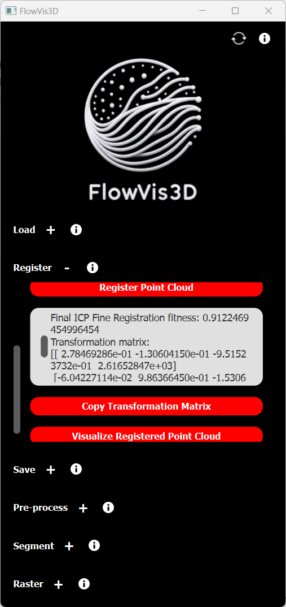

# flowvis-3d
Repository intended to perform the processing of an input point cloud containing Flow-Vis paint 3D data 

## Setup

To set up this project locally, follow these steps:

### Prerequisites

- Ensure you have Python 3.10.11 or higher installed.
- Install Poetry. [See Poetry's documentation for installation instructions](https://python-poetry.org/docs/#installation).

### Installation

1. **Clone the repository**

   ```sh
   git clone https://github.com/airframa/flowvis-3d.git
   cd flowvis-3d
   ```

2. **Install dependencies**

   - Configure Poetry to create the virtual environment within the project directory:

     ```sh
     poetry config virtualenvs.in-project true
     ```

   - Then, install dependencies with Poetry:

     ```sh
     poetry install
     ```

   This creates a `.venv` directory inside your project and installs all dependencies.

3. **Select Python Interpreter**

   After installing the dependencies, set the Python interpreter to the one recommended by the virtual environment. On VS code:

   - Press `Ctrl+Shift+P` to open the command palette.
   - Type `Python: Select Interpreter` and press Enter.
   - Choose the recommended interpreter which should correspond to the virtual environment you've created, typically `.venv: poetry`.


### Running the Application

- **Activate the virtual environment:**

  - **Windows:**
    ```
    .venv\Scripts\activate
    ```
  - **Unix/MacOS:**
    ```
    source .venv/bin/activate
    ```

- **Start the application by running on the terminal:** `python app_launch.py`

## Application Functionalities

### 1. Loading Point Cloud Data
The application provides a user-friendly interface for loading point cloud data. Users can:
- Select a point cloud file in `.ply` format using a file dialog or drag-and-drop.

  <div align="center">
    
  </div>

- Visualize the loaded point cloud in a 3D view.

  <div align="center">
    
  </div>

### 2. Registration of Point Cloud Data
The application includes registration features to align point clouds to a user-defined reference. Users can:
- Select a reference point cloud file in `.ply` or `.stl` format. The `.ply` format is preferred since in case a `.stl` file is uploaded, the application will have to convert the file first to a `.ply` format to perform the registration.
- Set registration parameters such as voxel size and desired accuracy.
- Perform registration using RANSAC Global Registration and ICP algorithms.

  <div align="center">
    
  </div>

- Copy the transformation matrix to the clipboard.
- Visualize the registered point cloud alongside the reference geometry to assess the registration quality.

  <div align="center">
    
  </div>

### 3. Saving Registered Data
The application supports saving the registered point cloud data and uploading it to a sandbox environment. Users can:
- Provide metadata such as model, WT Run, WT Map, car part, and load condition for correct file naming.

  <div align="center">
    
  </div>

- Save the registered point cloud and mesh data (if available) in appropriate formats for further analysis.
- Automatically upload either the registered data or the input mesh (according to the user preference) to a predefined sandbox location for sharing and comparison with the available CFD data. 

  <div align="center">
    
  </div>

## Future Functionalities

🚧 **Work in Progress**: Application currently under development. Further functionalities will be added soon. The coming features will include:

### 1. Preprocessing
The preprocessing functionality will include:
- Downsampling the input registered point cloud to reduce data size.
- Estimating the normals of the point cloud to perform further downstream tasks.

  <div align="center">
    
  </div>

### 2. Segmentation
The segmentation functionality will involve an unsupervised point cloud segmentation step consisting in:
- Dividing the point cloud into coarse surfaces using K-means clustering.
- Segmenting the point cloud into coherent surfaces using the DBSCAN algorithm.

  <div align="center">
    
  </div>

  <div align="center">
    
  </div>

### 3. Rasterization
The rasterization functionality will include:
- Orienting each point cloud segment using Principal Component Analysis (PCA).
- Projecting each PCA-rotated segment onto an optimal 2D plane to obtain a 2D representation of the segment for further processing.

  <div align="center">
    
  </div>

  <div align="center">
    
  </div>  

### 4. Flow Feature Detection
The flow feature detection functionality will include:
- Abstracting flow features from the rasterized 2D images of flowvis paint.
- Classifying and clustering the flow features to detect flow phenomena such as transitions and separations, as well as extracting directional fields from the available data

  <div align="center">
    
  </div>

  <div align="center">
    
  </div> 

  <div align="center">
    
  </div> 

### 4. 2D-3D Interpolation
The 2D-3D interpolation functionality will include:
- Interpolating the flow features' z-coordinate (point-wise) by considering the z coordinate of the nearest neighbours of the points of each flow feature
- Allowing for a smooth correlation between flowvis and CFD data in the 3D space

  <div align="center">
    
  </div>

  <div align="center">
    
  </div>  

The source code for such functionalities is already included in the `point_cloud_processor.py` file in the `components` directory. The source code will be used soon as back-end to include the above-mentioned functionalities in the application's features. 


